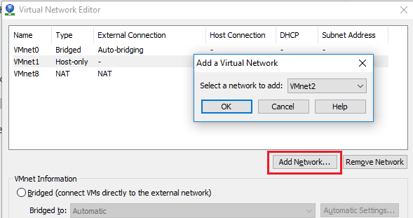
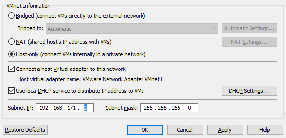
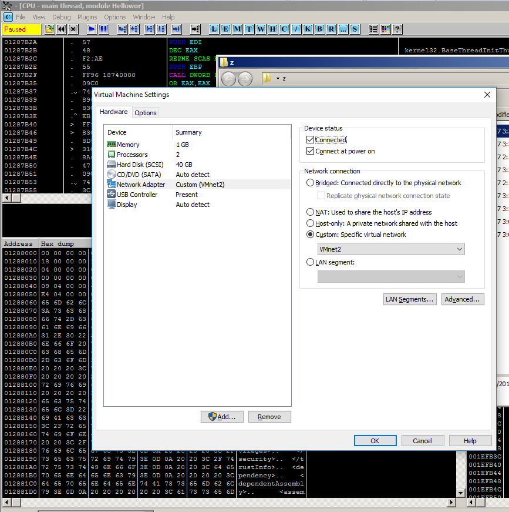
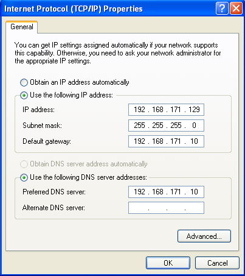
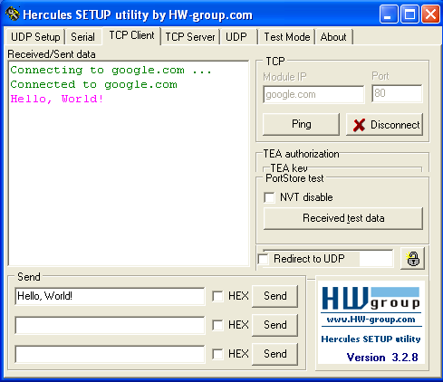
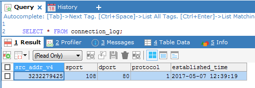

# Install your internet gateway to monitor for unusual and malicious behavior
## TL;DR
Sometimes, you want to know what malicious software (malware) has sent to internet but you don't have much time to analyze (the fact that, you are too lazy). You have to think about a solution to monitor network behavior. This project can monitor all network traffic and write malicious data to database.

## Setup environment
I use VMware to setup virtual machine. VirtualBox and the other kinds of virtual machine are good choices, but I have not tested with them. At least, we need 02 machines: a Microsoft Windows machine and a Linux machine. Both machine can connect to each other.
I add a new private network for these machines:<br />

<br />


Finally, I configure network adapters on both machines.<br />



## Install gateway
I use Ubuntu linux operating system and configure it as a gateway. You can use other operating systems, such as: Centos,Debian,... This is not a real gateway. It DOES NOT forward any packets to destination route. It captures all packets.

**Configure iptables**
I assign static IP address (**192.168.171.10**) for Linux machine which is used as a gateway.
``` bash
root@ubuntu:~# ip a
1: lo: <LOOPBACK,UP,LOWER_UP> mtu 65536 qdisc noqueue state UNKNOWN group default qlen 1
    link/loopback 00:00:00:00:00:00 brd 00:00:00:00:00:00
    inet 127.0.0.1/8 scope host lo
       valid_lft forever preferred_lft forever
    inet6 ::1/128 scope host
       valid_lft forever preferred_lft forever
2: ens33: <BROADCAST,MULTICAST,UP,LOWER_UP> mtu 1500 qdisc pfifo_fast state UP group default qlen 1000
    link/ether 00:0c:29:b5:d2:bf brd ff:ff:ff:ff:ff:ff
    inet 192.168.66.201/24 brd 192.168.66.255 scope global ens33
       valid_lft forever preferred_lft forever
    inet6 fe80::20c:29ff:feb5:d2bf/64 scope link
       valid_lft forever preferred_lft forever
3: ens38: <BROADCAST,MULTICAST,UP,LOWER_UP> mtu 1500 qdisc pfifo_fast state UP group default qlen 1000
    link/ether 00:0c:29:b5:d2:c9 brd ff:ff:ff:ff:ff:ff
    inet 192.168.171.10/24 brd 192.168.171.255 scope global ens38
       valid_lft forever preferred_lft forever
    inet6 fe80::20c:29ff:feb5:d2c9/64 scope link
       valid_lft forever preferred_lft forever
```

I have to configure iptables to forward all traffic to a local port, for example, 9999.
``` bash
iptables -t nat -A PREROUTING -i ens38 -p tcp --dport 1:65535 -j LOG --log-prefix "INPUT:SINKHOLE:" --log-level 6
iptables -t nat -A PREROUTING -i ens38 -p tcp --dport 1:65535 -j REDIRECT --to-ports 9999
```
I forward all logs to our syslog server by creating new rule in `/etc/rsyslog.d/`. Following the example set by `20-ufw.conf`, create a file under `/etc/rsyslog.d/00-sinkhole.conf` containing:

```
:msg, contains, "INPUT:SINKHOLE:"         @@127.0.0.1:10514
& ~
```


## Syslog server, sinkhole server
I have used twisted library to implement sinkhole server.
 - DNSServerFactory: a simple DNS server. It always returns the ip address of sinkhole server for any domain.
 - SyslogdProtocol: this server processes all logs from rsyslog service. These are logs which are generated during iptables redirection. The result are source ip address and source port.
 - SinkholeServer: a server will receive all traffic from malware and store them in database.
 - DatabaseConnector: a driver which is used to communicate with the mysql database.

Install some prerequisite:
``` bash
apt-get install python python-dev python-pip libmysqlclient-dev mysql-client
pip install twisted MySQL-python
```

And now, run [sinkhole server](sinkhole-server/sinkhole.py) and check database. Maybe, you should pass **-i** parameter to initialize database:
``` bash
python sinkhole.py -i
```
Finally, I restart rsyslog service. `rsyslog` will use my syslog server.
``` bash
service rsyslog restart
```
**Note:** because 53 is a "privileged" port, you should run server as root to bind. Or, you may edit DNS port number to another one and use iptables to redirect traffic.

## Result
I configure client IP address as:<br />


I use a simple GUI network tool to create a connection to **google.com:80**<br />


And then, I query database for result:

You can see, client queries DNS server for domain **google.com**<br />


After that, client creates a TCP connection to my **fake** server: <br />


Finally, client sends **Hello, World!**:<br />


## Conclusions
This article gives you a brief introduction to malicious network traffic analysis. Now, you can setup a small and very simple laboratory at home and try it. In the future I will post our experience on similar analysis to give you a better picture about what actually out there and how we can understand them in order to minimize their impact.

## Reference
https://superuser.com/questions/440324/iptables-how-to-forward-all-external-ports-to-one-local-port
http://fibrevillage.com/sysadmin/202-enable-linux-iptables-logging
https://askubuntu.com/questions/348439/where-can-i-find-the-iptables-log-file-and-how-can-i-change-its-location
http://stackoverflow.com/questions/37034439/rsyslog-filtering-and-forwarding
http://stackoverflow.com/questions/413807/is-there-a-way-for-non-root-processes-to-bind-to-privileged-ports-on-linux